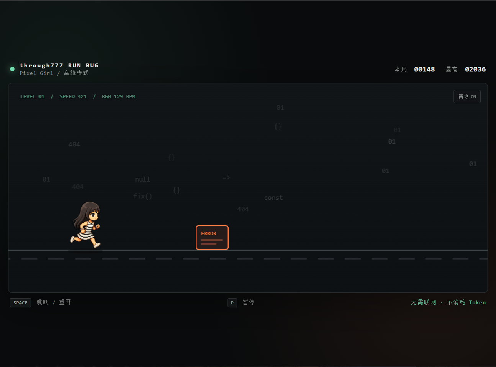
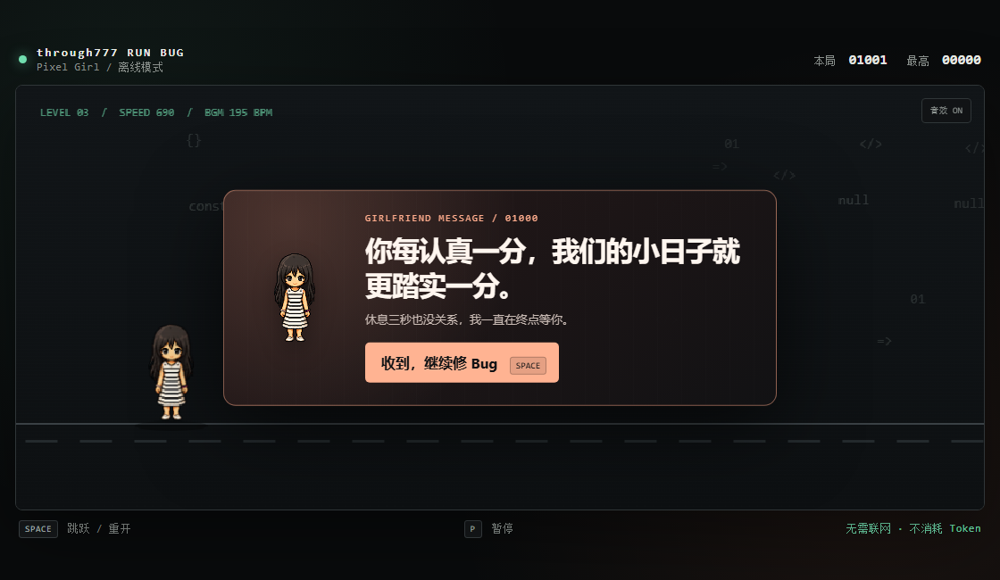
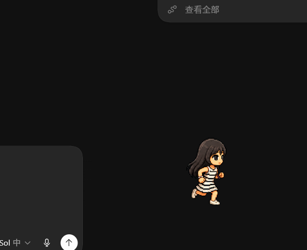

# through777 Run Bug：像素角色、Codex 宠物与 EXE 打包指南

本文记录本项目从一张像素人物参考图，制作成 Codex 自定义宠物，再复用同一套动画图集开发离线跑酷小游戏并打包为 Windows EXE 的完整流程。

> 项目特点：角色和游戏资源均保存在本地；游戏运行时不调用任何 AI API，不联网，也不消耗 Token。

## 1. 最终成果

本项目产出了两套可以独立使用的内容：

1. **Codex 自定义宠物**：安装到 Codex 的 Pets 系统中，根据 Codex 状态播放待机、工作、等待、失败等动画。
2. **through777 Run Bug**：参考 Chrome 断网小恐龙制作的离线 Canvas 跑酷小游戏，支持跳跃、随机障碍、计分、最高分、提示音和随速度加快的动态 BGM。

核心素材是同一张透明动画图集：

```text
pixel-girl.webp
```

实际效果：







## 2. 仓库建议结构

```text
through777-run-bug/
├─ pixel-girl.webp          # 8 列 × 9 行角色动画图集
├─ docs/
│  └─ contact-sheet.png     # 可选：动画动作预览
├─ index.html               # 游戏页面
├─ styles.css               # 游戏界面样式
├─ game.js                  # 跑酷、动画、碰撞和音频逻辑
├─ main.cjs                 # Electron 主进程，打包 EXE 时添加
├─ package.json             # Electron 打包配置，打包时添加
├─ launch-game.ps1          # 未打包时的 Windows 启动器
├─ README.md
├─ BUILD_GUIDE.zh-CN.md
├─ LICENSE
└─ .gitignore
```

## 3. 像素小人如何生成

### 3.1 准备参考图

准备一张正面、完整身体、轮廓清晰的人物参考图。最好满足：

- 人物没有被裁切；
- 背景尽量纯净；
- 发型、服装、饰品和颜色容易辨认；
- 小尺寸下仍能看清主要特征；
- 你拥有公开和再分发该形象的权利。

本项目的人物识别要点是：长黑发、大眼睛、黑白横条纹连衣裙、白鞋，以及彩色手链。因为左右手饰品并不完全对称，左跑动画没有简单镜像右跑动画，而是单独生成。

### 3.2 使用 Codex 的 hatch-pet 工作流

本项目使用 Codex 的 `hatch-pet` 技能组织生成流程，并使用图像生成能力制作基础角色和各行动画。

可以向 Codex 提交类似请求：

```text
请使用 hatch-pet，把这张参考图制作成 Codex 自定义宠物。

要求：
- 保持像素画风格；
- 保持长黑发、条纹裙、白鞋和彩色手链；
- 生成完整 9 种 Codex 状态；
- 每个动作保持同一人物比例和配色；
- 最终输出透明背景 WebP 动画图集；
- 生成 contact sheet 和 GIF 动作预览并完成视觉检查。
```

生成时先建立一张“基础角色图”作为身份基准，然后每个动画状态都引用该基准图。这样能减少不同动画之间的脸型、衣服和身体比例漂移。

### 3.3 Codex 宠物图集规格

最终图集必须满足以下几何规格：

- 图集尺寸：`1536 × 1872`；
- 网格：`8 列 × 9 行`；
- 单格尺寸：`192 × 208`；
- 格式：支持透明通道的 PNG 或 WebP；
- 没有使用的格子必须保持完全透明；
- 每一格只允许出现一个完整角色姿势。

本项目采用的状态排列如下：

| 行号 | 状态 | 帧数 | 用途 |
|---:|---|---:|---|
| 0 | `idle` | 6 | 待机、呼吸、眨眼 |
| 1 | `running-right` | 8 | 向右移动 |
| 2 | `running-left` | 8 | 向左移动 |
| 3 | `waving` | 4 | 挥手 |
| 4 | `jumping` | 5 | 跳跃 |
| 5 | `failed` | 8 | 失败或受挫 |
| 6 | `waiting` | 6 | 等待用户输入或批准 |
| 7 | `running` | 6 | Codex 正在工作 |
| 8 | `review` | 6 | 检查或审阅 |

合计使用 52 帧。

### 3.4 推荐生成顺序

1. 根据参考图生成基础角色图。
2. 先生成 `idle` 和 `running-right`，确认角色身份和奔跑节奏。
3. 判断 `running-left` 是否适合镜像；存在不对称饰品时应单独生成。
4. 分别生成 `waving`、`jumping`、`failed`、`waiting`、`running` 和 `review`。
5. 将每行动画从纯色背景中抠出，切分为 `192 × 208` 的透明帧。
6. 合成 `1536 × 1872` 图集。
7. 检查透明像素、空白格、裁切、尺寸跳变和人物身份一致性。
8. 生成 contact sheet 和逐行动画 GIF 进行最终视觉检查。

### 3.5 透明背景和边缘处理

图像生成阶段可以使用与角色配色冲突较少的纯色背景，随后进行色键抠图。需要重点检查：

- 头发和裙摆边缘是否残留背景色；
- 透明像素是否仍保存脏 RGB 颜色；
- 手链等彩色细节是否被误删；
- 每帧脚底基线是否稳定；
- 动作之间是否出现角色突然变大或变小。

本项目在普通色键抠图后额外执行了边缘去色，只处理中透明边界附近的背景色残留，同时保留手链内部的青色和粉色。

### 3.6 验收标准

在进入游戏或 Codex 前，至少确认：

- 图集为 `1536 × 1872`；
- 色彩模式包含 Alpha 通道；
- 52 个已用格子都有内容；
- 未使用格子完全透明；
- 9 行动作语义正确；
- 左右跑方向正确；
- 没有白底、色边、裁切和跨格重叠；
- 动画播放时没有明显尺寸跳动。

## 4. 如何安装为 Codex 自定义宠物

Codex 自定义宠物目录位于：

```text
%USERPROFILE%\.codex\pets\<pet-id>\
```

本项目示例：

```text
%USERPROFILE%\.codex\pets\pixel-girl\
├─ pet.json
└─ spritesheet.webp
```

`pet.json` 内容：

```json
{
  "id": "pixel-girl",
  "displayName": "Pixel Girl",
  "description": "A cheerful black-haired pixel-art girl in a striped dress who follows Codex work.",
  "spritesheetPath": "spritesheet.webp"
}
```

PowerShell 安装示例：

```powershell
$petDir = Join-Path $env:USERPROFILE '.codex\pets\pixel-girl'
New-Item -ItemType Directory -Path $petDir -Force | Out-Null
Copy-Item '.\pixel-girl.webp' (Join-Path $petDir 'spritesheet.webp') -Force
Copy-Item '.\codex-pet\pet.json' (Join-Path $petDir 'pet.json') -Force
```

安装后在当前 Codex 中：

1. 打开个人资料或 Settings；
2. 进入 **Pets**；
3. 点击 **Refresh custom pets**；
4. 选择 **Pixel Girl**；
5. 输入 `/pet` 唤醒或收起宠物。

如果窗口仍显示旧宠物，先收起旧宠物，然后刷新 Pets。部分免安装版可能需要重新加载当前 Codex 窗口才能清除内存缓存。开源项目不建议直接修改 Codex 内部配置字段，因为这些字段可能随版本变化。

参考资料：

- [OpenAI / Codex Pets 文档](https://learn.chatgpt.com/docs/pets)
- [CSDN：Codex 桌面宠物相关教程](https://blog.csdn.net/weixin_41961749/article/details/160935565)

## 5. 如何在小游戏源码中使用同一角色

### 5.1 加载图集

```js
const sprite = new Image();
sprite.src = 'pixel-girl.webp';

const CELL_W = 192;
const CELL_H = 208;

const rows = {
  idle: 0,
  run: 1,
  jump: 4,
  failed: 5,
};
```

### 5.2 从图集中绘制单帧

Canvas 的 `drawImage` 可以只截取图集中的一个格子：

```js
const frameIndex = 2;
const state = 'run';

ctx.drawImage(
  sprite,
  frameIndex * CELL_W,
  rows[state] * CELL_H,
  CELL_W,
  CELL_H,
  player.x,
  player.y,
  92,
  100,
);
```

前四个参数定义图集中的源区域，后四个参数定义游戏画面中的显示位置和大小。

### 5.3 动画帧切换

```js
const frameIndex = Math.floor(frameClock * fps) % frameCount;
```

- 奔跑动画使用较高 FPS；
- 跳跃时切换到 `jumping` 行；
- 撞到障碍后切换到 `failed` 行；
- 游戏未开始时使用 `idle` 行。

### 5.4 游戏机制

本项目的游戏循环由 `requestAnimationFrame` 驱动，主要包含：

1. 根据时间差更新角色重力和垂直速度；
2. 随机生成 Bug、ERROR 弹窗和警告牌；
3. 所有障碍按照当前速度向左移动；
4. 使用缩小后的碰撞框判断角色是否撞到障碍；
5. 根据移动距离计算分数；
6. 分数增加时逐渐提高游戏速度；
7. 使用 `localStorage` 保存最高分。

### 5.5 动态 BGM

本项目不包含外部音乐文件，而是使用 Web Audio API 实时合成 8-bit BGM：

- 开局约 `105 BPM`；
- 随游戏速度逐渐提升；
- 最高约 `195 BPM`；
- 150 BPM 后增加高频节拍；
- 178 BPM 后加入高八度旋律；
- 暂停、失败时停止；
- 开始、跳跃和失败分别有独立提示音。

浏览器通常要求用户第一次点击或按键后才能启动音频，因此应在开始按钮、空格键或点击事件中调用：

```js
await audioContext.resume();
```

## 6. 未打包时如何运行

直接双击 HTML 虽然可以运行，但为了获得更接近桌面程序的独立窗口，本项目使用 Microsoft Edge 的应用模式：

```powershell
$uri = [System.Uri]::new((Resolve-Path '.\index.html')).AbsoluteUri
Start-Process msedge.exe -ArgumentList @("--app=$uri", '--window-size=1120,650')
```

这种方式不需要安装 Node.js，但用户电脑需要有 Microsoft Edge。

## 7. 打包成 Windows EXE

推荐使用 Electron 和 electron-builder。它们会把本地 HTML、JavaScript、图片和 Chromium 运行时一起打包，目标电脑无需安装 Node.js。

### 7.1 环境要求

- Node.js `22.12.0` 或更高版本（以当前 Electron 43 的要求为准）；
- npm；
- Windows 10/11；
- 足够的磁盘空间。Electron 打包结果会明显大于纯网页源码。

### 7.2 安装依赖

在项目根目录执行：

```bash
npm init -y
npm install --save-dev electron electron-builder
```

### 7.3 新建 `main.cjs`

```js
const { app, BrowserWindow } = require('electron');
const path = require('node:path');

function createWindow() {
  const win = new BrowserWindow({
    width: 1120,
    height: 650,
    minWidth: 800,
    minHeight: 520,
    autoHideMenuBar: true,
    backgroundColor: '#090b0c',
    title: 'through777 Run Bug',
    webPreferences: {
      contextIsolation: true,
      sandbox: true,
    },
  });

  win.loadFile(path.join(__dirname, 'index.html'));
}

app.whenReady().then(() => {
  createWindow();

  app.on('activate', () => {
    if (BrowserWindow.getAllWindows().length === 0) createWindow();
  });
});

app.on('window-all-closed', () => {
  if (process.platform !== 'darwin') app.quit();
});
```

### 7.4 配置 `package.json`

```json
{
  "name": "through777-run-bug",
  "version": "1.0.0",
  "description": "An offline Pixel Girl runner game inspired by the Chrome dinosaur game.",
  "main": "main.cjs",
  "author": "through777",
  "license": "MIT",
  "scripts": {
    "start": "electron .",
    "dist": "electron-builder --win portable"
  },
  "devDependencies": {
    "electron": "^43.1.1",
    "electron-builder": "^26.15.3"
  },
  "build": {
    "appId": "com.through777.runbug",
    "productName": "through777 Run Bug",
    "asar": true,
    "files": [
      "index.html",
      "styles.css",
      "game.js",
      "main.cjs",
      "pixel-girl.webp"
    ],
    "win": {
      "target": "portable",
      "icon": "build/icon.ico"
    },
    "artifactName": "through777-Run-Bug-${version}.${ext}"
  }
}
```

版本号只是示例。首次实施时建议运行 `npm install`，让 npm 写入当前兼容版本和锁文件，不必机械复制示例中的依赖版本。

如果暂时没有图标，可以先删除 `win.icon`。正式发布时建议准备至少 `256 × 256` 的 `build/icon.ico`。

### 7.5 本地开发测试

```bash
npm start
```

重点测试：

- 空格键、方向上键和鼠标点击能否跳跃；
- 开始、跳跃、失败提示音是否正常；
- 动态 BGM 是否随速度加快；
- 失败后能否立即重开；
- 关闭窗口后进程是否退出；
- 没有网络时是否仍可运行。

### 7.6 生成单文件 EXE

```bash
npm run dist
```

输出通常位于：

```text
dist/through777-Run-Bug-1.0.0.exe
```

`portable` 目标生成无需安装的单文件 EXE。如果需要标准安装向导，可将目标改成：

```json
"win": {
  "target": ["portable", "nsis"]
}
```

## 8. 开源前的检查

### 8.1 `.gitignore`

```gitignore
node_modules/
dist/
release/
*.log
.DS_Store
Thumbs.db
```

### 8.2 许可证

代码可以选择 MIT、Apache-2.0 等开源许可证，但角色素材必须单独确认授权。建议在 README 中明确：

```text
Source code is licensed under the MIT License.
Character artwork and sprite assets are licensed separately; see ASSET_LICENSE.md.
```

如果参考图来自第三方网站、动画、游戏或壁纸平台，不要在没有授权的情况下把角色素材直接声明为 MIT。最稳妥的方式是只开源代码，要求使用者自行替换 `pixel-girl.webp`，或者为素材单独取得明确授权。

### 8.3 不应提交的内容

- Codex 的个人配置文件；
- 本机用户名和绝对路径；
- API Key、Cookie 或登录信息；
- 临时生成目录和缓存；
- 未获授权的参考图；
- `node_modules` 和重复的构建产物。

## 9. 推送到 GitHub

```bash
git init
git add .
git commit -m "feat: release through777 Run Bug"
git branch -M main
git remote add origin https://github.com/<your-name>/through777-run-bug.git
git push -u origin main
```

如果使用 GitHub CLI：

```bash
gh repo create through777-run-bug --public --source=. --remote=origin --push
```

## 10. 发布建议

建议每次发布同时提供：

- 源码 ZIP；
- Windows portable EXE；
- SHA-256 校验值；
- 游戏截图或短视频；
- 操作说明；
- 代码许可证和素材许可证；
- Windows SmartScreen 提示说明。

未签名的个人 EXE 可能触发 Windows SmartScreen。这不等同于程序有病毒；但公开发布时应提供源码、哈希值，并在条件允许时使用代码签名证书。

## 11. 核心思路总结

整套流程的关键不是直接让图像模型生成一张大图集，而是：

1. 用一张基础角色锁定身份；
2. 分状态生成独立动画；
3. 使用确定性的脚本切帧、去背景和合成图集；
4. 同时进行尺寸校验和人工视觉检查；
5. 让 Codex 宠物与游戏共享同一张动画图集；
6. 游戏只负责选择正确的行和帧，不重复维护角色素材；
7. 最后用 Electron 将离线网页游戏封装为 Windows EXE。

这样可以同时获得可维护的 Codex 宠物、可复用的游戏素材和适合 GitHub 发布的完整源码。
